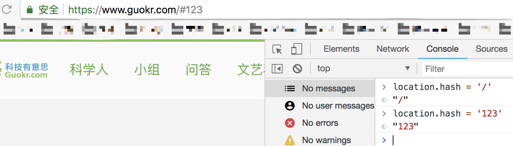

# 单页面前端路由

单页面前端路由有两种模式：hash 和 history

## 基础知识：

### window.location

- `location.href`

- `location.hash`

- `location.search`

- `location.pathname`

  

hash模式就是通过location.hash改变 url 不刷新页面


### window.history

`window.history`属性指向 History 对象，它表示当前窗口的浏览历史。

History 对象保存了当前窗口访问过的所有页面网址。下面代码表示当前窗口一共访问过3个网址。

```
window.history.length // 3
```

由于安全原因，浏览器不允许脚本读取这些地址，但是允许在地址之间导航。

```
// 后退到前一个网址
history.back()

// 等同于
history.go(-1)
```

浏览器工具栏的“前进”和“后退”按钮，其实就是对 History 对象进行操作。

History 对象主要有两个属性。

- `History.length`：当前窗口访问过的网址数量（包括当前网页）

- `History.state`：History 堆栈最上层的状态值（详见下文）

  

[history 接口](https://developer.mozilla.org/zh-CN/docs/Web/API/History)是 HTML5 新增的，它有五个方法可以改变 url 而不刷新页面。

* back()

  在历史记录中后退 `history.back()`  

* forward()

  在历史记录中前进 `history.forward()`

* go()

  移动到指定的历史记录点 `history.go(-1)`

  通过指定一个相对于当前页面位置的数值，你可以使用go()方法从当前会话的历史记录中加载页面（当前页面位置索引值为0，上一页就是-1，下一页为1）

  go()不填参数或参数为go(0)时，页面会刷新，即`history.go()`或`history.go(0)`相当于`location.reload()`

* pushState()

  `pushState(any data, string title, [string url])`

  第一个参数为`history`对象的`state`属性值，可以放任意数据，记录历史状态。第二个参数是新状态的标题，目前浏览器基本不支持。第三个参数为可选的相对url。

  执行`pushState`后，可以在不加载新页面的情况下，更改url。同时`history`栈中新增一条数据。

* replaceState()

  `replaceState(any data, string title, [string url])`

  与`pushState()`类似，只是在`history`栈中不是新增记录，而是替换一条记录。

  

**注意事项：**`pushState()`和`replaceState()`方法存在安全方面的限制，本地静态测试是无效的，会报错，需要放到服务器上来查看效果（可以本地用http-server开一个简单的服务器等方法测试）。


使用location.href等方法，会改变当前history的堆栈值，并且会删除当前后面的值


## 监听 url 的变化

### hashchange

`hashchange` 事件能监听 url hash 的改变。

代码实例：

```
window.addEventListener('hashchange', function(e) {
  console.log(e)
})
```


### popstate

[popstate](https://developer.mozilla.org/zh-CN/docs/Web/Events/popstate) 事件能监听除 `history.pushState()` 和 `history.replaceState()` 外 url 的变化。

代码实例：

```
window.addEventListener('popstate', function(e) {
  console.log(e)
})
```

其实不止 `history.pushState()` 和 `history.replaceState()` 对 url 的改变不会触发 `popstate` 事件，当这两个方法只改变 url hash 时也不会触发 `hashchange` 事件。


参考文档

https://segmentfault.com/a/1190000014120456

https://gaohaoyang.github.io/2015/12/31/History-API

https://javascript.ruanyifeng.com/bom/history.html#toc7